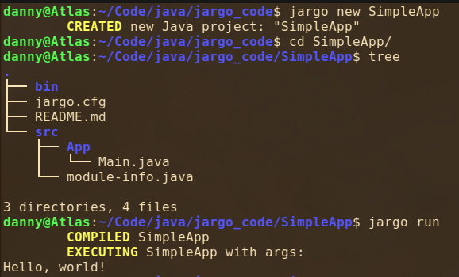

# Jargo

A simplified way of managing Java projects

## Table of Contents

- [Overview](#overview)
  - [Background](#background)
  - [Features](#features)
- [Usage](#usage)
- [Installation](#installation)

## Overview

Jargo is a simple project manager for Java, heavily inspired by Rust's [cargo](https://github.com/rust-lang/cargo/).

### Background

The idea for Jargo came from my dislike of having to use `javac` and `java` repeatedly while working with Java projects on the command line.
After I began using Rust, I saw the benefits of a proper package manager, so I looked to Maven and Gradle to handle similar functionality in Java.
Both of those options provided far more features and complexity than I needed, so I took matters into my own hands.
What originally began as two aliases in my shell's configuration file grew rapidly into Jargo.

Note: Jargo is not intended to be a replacement for Maven or Gradle, by any means.
This was created to make my life easier when working with Java on the command line, that's all.

### Features

I wanted Jargo to make project management simple, so I made sure it had the essentials:

- Create a new Java project
- Compile the project if source files have been edited
- Run the project in a one simple command

As I continued to write this, I discovered a few more features that were quite simple to implement and made the whole program feel a bit nicer, so I threw them in.

## Usage

The basic syntax is `jargo [OPTIONS] [COMMANDS]`, which is quite similar to `cargo` (for good reason).

Here are a few of the basic commands and options:

- `jargo new <PROJECT> [OPTIONS]` - Create and initialize a new Java project
- `jargo init` - Initialize an existing project to be compatible with Jargo
- `jargo build` - Compile the current project
- `jargo run [ARGUMENTS]` - Execute the project with the supplied arguments, compiling if necessary
- `jargo clean` - Removes all `*.class` files
- `jargo doc` - Generate Javadocs for the current project

## Example

Below is an example usage to create a run a basic Hello World application.

## Installation

I'll put more in this section once I have this more fleshed out. But for now, here's the steps:

1. Download the `jargo` script
2. Mark it as executable by `chmod u+x jargo`
3. Create a symlink so you can execute it anywhere `ln -s /path/to/jargo /usr/local/bin`

If you want to use the `--jfx` flag when running or compiling, you need to have `$PATH_TO_FX` set in your shell's environment variables.
This should be the path to the appropriate version of JavaFX's `lib/` folder.

Of course, you need Java installed :)
